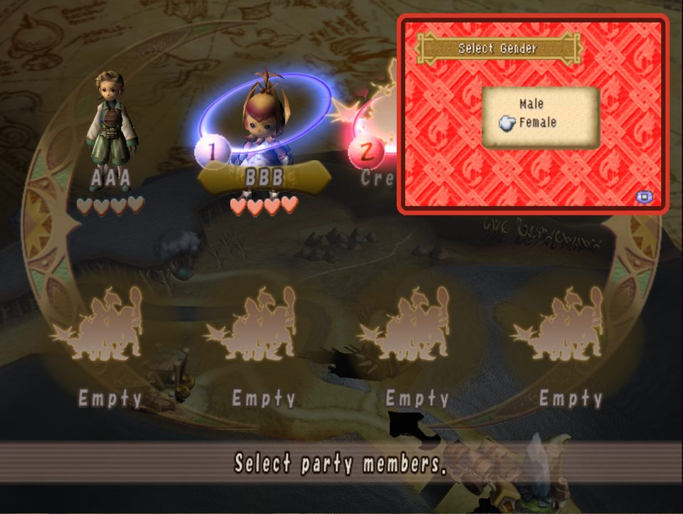
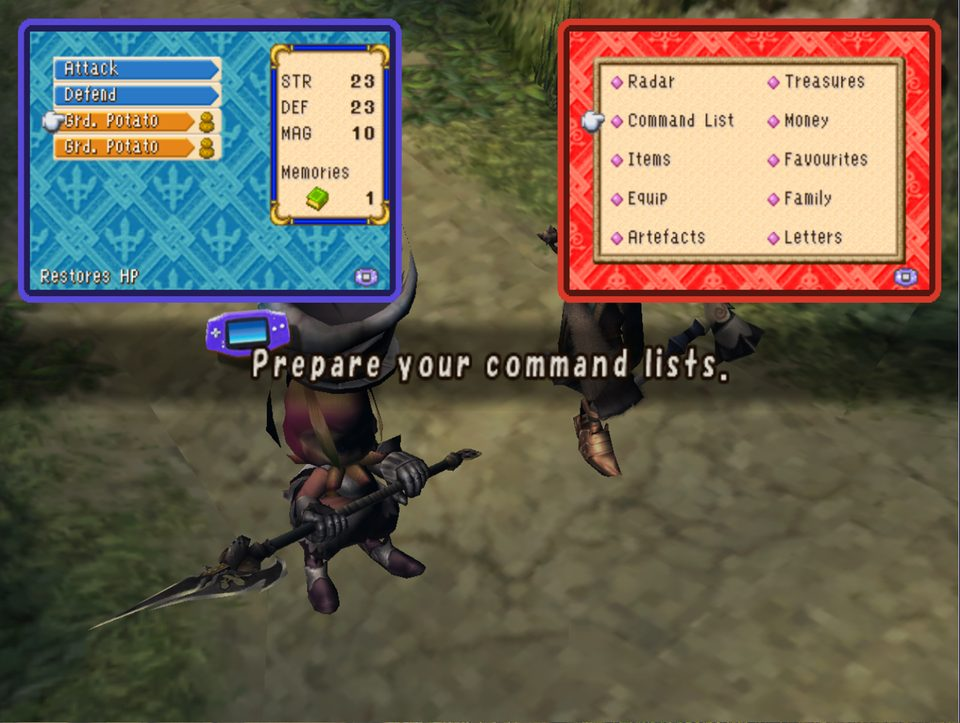
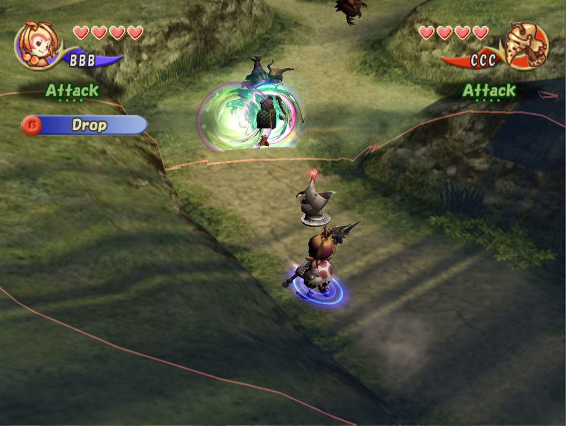
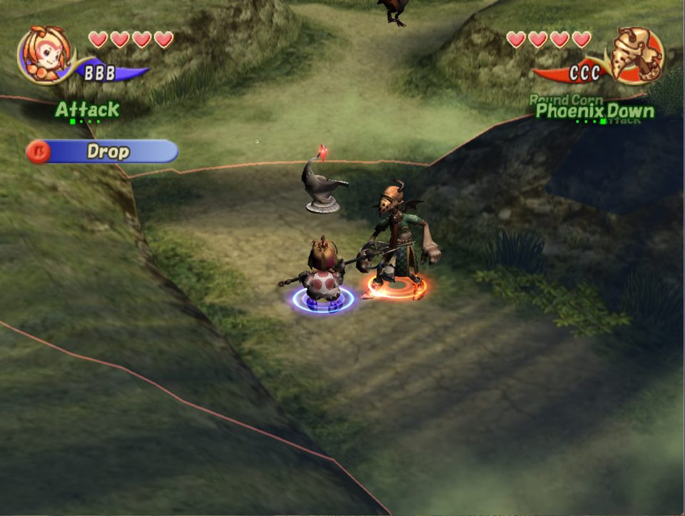

# Final Fantasy Crystal Chronicles (GameCube, PAL) on WiiCompiled

This branch teaches WiiCompiled's translator and runtime to run the PAL GameCube release of
Final Fantasy Crystal Chronicles (`GCCP01`) natively on PC, including the game's multiplayer mode,
which on real hardware needs one Game Boy Advance per player. Here every player's handheld is an
emulated GBA running the game's own client program, drawn in the corners of the screen.

Nothing from the game ships with this repository. You need your own dumped PAL disc; the
translator reads the executable inside your disc, the runtime reads your extracted disc files, and the handheld
client program is uploaded by the game itself from your disc at run time, exactly as it would be
to a real GBA.

## Screenshots

| Character creation on the handheld clients | Dungeon start: one player on the command list, the other in the hub |
| --- | --- |
|  |  |

| Client hub menu | Combat |
| --- | --- |
|  |  |

Videos (from a two-player session): [character creation](https://github.com/luiscota99/Wiicompiled/releases/download/ffcc-media-1/ffcc_creation.mp4), [dungeon start, client menus and combat](https://github.com/luiscota99/Wiicompiled/releases/download/ffcc-media-1/ffcc_dungeon_menus.mp4); GIF versions: [creation](https://github.com/luiscota99/Wiicompiled/releases/download/ffcc-media-1/ffcc_creation_small.gif), [dungeon](https://github.com/luiscota99/Wiicompiled/releases/download/ffcc-media-1/ffcc_dungeon_menus_small.gif).

## Status

Working:

- Title, roster, character creation (on the GBA client or the GameCube menu), towns, world map,
  dungeons, combat, saves.
- One to four players, each on an emulated GBA client: the client's own screens (radar, command
  list, items, equipment, artefacts, treasures, money, favourites, family, letters) with the
  game streaming their data over the emulated link, exactly as on hardware.
- Two extra players on one keyboard when only two gamepads are present.

Known limits:

- The PAL game renders one frame per two retraces (25 frames per second, as on hardware); the
  handheld screens follow that rate.
- Pausing shows the client's PAUSE card, as on hardware; the client menus are used during play.
- Some rendering issues remain (see the journal in the workspace repository, not part of this tree).

## Requirements

- Everything in the main [README](../README.md): .NET 8 SDK, CMake, Ninja, LLVM-MinGW.
- Your own PAL disc image of Final Fantasy Crystal Chronicles (`GCCP01`) as a plain .iso/.gcm.
  `scripts/ffcc/extract_disc.py` extracts it into the folder layout the runtime reads (`sys/` and
  `files/`, the same as Dolphin's Extract Entire Disc) and puts the game executable inside it where the
  translator wants it (`projects/ffcc/main.dol`). Compressed images (RVZ, GCZ, CISO) must be converted to ISO first.
- The mGBA submodule: `git submodule update --init third_party/mgba`.

## Build

1. Build the translator (see the main README).
2. Extract the disc. The `--dol` option drops the game executable inside the disc at the path the
   translator reads (its SHA-256 is checked against `projects/ffcc/recomp.yml`):

   ```
   python scripts/ffcc/extract_disc.py <game.iso> <disc folder> --dol projects/ffcc/main.dol
   ```

   The disc folder is what `[paths] dvd_root` points at in the configuration below.
3. Translate, generate the data initialiser and emit the build graph (the translator targets .NET 8;
   with only a newer runtime installed, set `DOTNET_ROLL_FORWARD=Major` first). Output goes to
   `generated/`, which is git-ignored:

   ```
   dotnet translator/src/Translator.Cli/bin/Release/net8.0/Translator.Cli.dll translate-recursive 0x80003154 --project projects/ffcc/recomp.yml --threads 8 --output-metadata generated/base_translation_output.json --prune-stale
   dotnet translator/src/Translator.Cli/bin/Release/net8.0/Translator.Cli.dll generate-data-init --project projects/ffcc/recomp.yml
   dotnet translator/src/Translator.Cli/bin/Release/net8.0/Translator.Cli.dll emit-build-shards --project projects/ffcc/recomp.yml --out generated/build_shards
   ```

4. Build mGBA as a static library (once):

   ```
   python scripts/ffcc/build_libmgba.py --toolchain <path to llvm-mingw/bin>
   ```

5. Configure and build the runtime with the FFCC project flag:

   ```
   cmake -G Ninja -S runtime -B build-ffcc -DCMAKE_BUILD_TYPE=Release -DCMAKE_C_COMPILER=<llvm-mingw>/bin/clang.exe -DCMAKE_CXX_COMPILER=<llvm-mingw>/bin/clang++.exe -DCMAKE_RC_COMPILER=<llvm-mingw>/bin/llvm-windres.exe -DCMAKE_CXX_FLAGS=-DRECOMP_PROJECT_FFCC=1
   cmake --build build-ffcc --target WiiCompiled --parallel 8
   ```

   The resource compiler must be LLVM-MinGW's `llvm-windres` (the toolchain's default is not found by cmake).
   On Windows, cmake also needs the C++/WinRT headers of a Windows SDK
   (`-DMKW_CPPWINRT_INCLUDE_DIR="C:/Program Files (x86)/Windows Kits/10/Include/<version>/cppwinrt"`).
   Re-run the translate step whenever a native override is added or removed (a new hooked
   address changes the translation).

## Configuration

The runtime keeps its user data (config, saves, caches, logs) in `%LOCALAPPDATA%\WiiCompiled` unless an
empty file named `portable.txt` sits next to `WiiCompiled.exe`, in which case everything lives in a
`UserData` folder beside it. For a build tree, create the marker once:

```
type nul > build-ffcc\portable.txt
```

Then edit `build-ffcc/UserData/Config.toml` (created on first start, or write it yourself):

```toml
[paths]
dvd_root = "<disc folder from the extract step>"

[gba]
# Players on emulated handheld clients (1-4): ports 1..n. Default 2.
players = 4
```

Environment variables for testing: `WIICOMPILED_FAKE_GBA=0,1,2,3` overrides the port list,
`WIICOMPILED_GBA=fake` uses the hand-made screens instead of the emulated client,
`WIICOMPILED_GBA_DIRECT=0` disables the hybrid input, `WIICOMPILED_GBA_TRACE=<file>` records every
word exchanged with the clients (see below).

### Environment variables

All optional; the config file covers normal use.

| Variable | Effect |
| --- | --- |
| `WIICOMPILED_FAKE_GBA=0,1,2,3` | Port list of emulated handhelds; overrides `[gba] players`. |
| `WIICOMPILED_GBA=fake` | Hand-made handheld screens instead of the emulated client (no mGBA needed). |
| `WIICOMPILED_GBA_DIRECT=0` | Disable the hybrid input (client keys only through the emulated handheld). |
| `WIICOMPILED_GBA_HOSTBLIT=1` | Draw the handheld screens through the host overlay instead of in-game GX. |
| `WIICOMPILED_GBA_TRACE=<file>` | Record every word exchanged with the clients (replay with the harness). |
| `WIICOMPILED_CHEATS=god,dmg8` | Test cheats (invulnerability, damage multiplier). |
| `WIICOMPILED_STALL_SECONDS=<n>` | Abort with a stack dump when the guest makes no progress for n seconds. |
| `WIICOMPILED_WATCH=0xADDR,...` | Log writes to guest addresses. |
| `WIICOMPILED_STATS=1`, `FFCC_DEBUG_LOGS=1` | Extra runtime statistics and debug logging. |
| `WIICOMPILED_AUDIO_DUMP`, `WIICOMPILED_AX_VOLWB` | Audio debugging. |
| `WIICOMPILED_PAD_FILE`, `WIICOMPILED_SHOT_DIR`, `WIICOMPILED_NO_POPUP`, `WIICOMPILED_FAIL_FAST` | Automation: scripted pad input, frame captures, no dialogs, fail fast. |

## Adapting the runtime to another game

Everything game-specific is either in the project manifest or behind the `RECOMP_PROJECT_FFCC` compile
flag:

- `projects/<game>/recomp.yml`: memory layout, DOL hash, entry points, hooks.
- `runtime/src/hle/project_guest_addresses.h`: the SDK globals and callbacks the HLE needs, one block per
  project. Add a `RECOMP_PROJECT_<GAME>` block with your game's addresses (from a symbol map or a
  decompilation) and select it with `-DCMAKE_CXX_FLAGS=-DRECOMP_PROJECT_<GAME>=1`.
- `runtime/src/hle/ffcc/`: FFCC-only modules (the GBA link, menus, cheats); a new game gets its own
  directory. Game function addresses used by those modules live at the top of each file.
- Generic SDK changes made for the GameCube (OS, GX, audio, DVD, VI) are guarded by the project flag
  where they differ from the Wii behaviour, so the Mario Kart build is unchanged.

## Players and controls

The number of players is `[gba] players` in `Config.toml` (1 to 4). Ports 1..n each run an emulated
handheld client; the game itself decides what each player can do, exactly as with real handhelds.

**Which input drives which port.** Gamepads are assigned to ports in the order they are connected
(port 1 first). A port without a gamepad reads the keyboard through that port's own keyboard
bindings. Every binding is remappable: press **F10** in the game window, open **Controller settings**,
pick the port, and press the key you want for each button. Bindings are saved in
`UserData/keyboard_bindings.dat` next to the executable (portable layout) and survive updates.

Defaults when nothing has been remapped:

| Port | Move | A | B | Select | Start | L / R |
| --- | --- | --- | --- | --- | --- | --- |
| 1 (no gamepad) | WASD, arrows = stick | X | Z | Space | Enter | Q / E |
| 3 (no gamepad) | WASD | J | K | U | I | Q / E |
| 4 (no gamepad) | arrow keys | numpad 1 | numpad 2 | numpad 3 | numpad 0 | numpad 7 / 9 |

Port 2 has no keyboard default (it is expected to have a gamepad); give it one in the F10 bar if you
need it. On a gamepad the client's buttons are A/B, Back = Select, Start, the d-pad or left stick,
and the shoulder buttons for L/R. The GameCube-style X/Y/Z mappings exist for the port's pad but the
handheld protocol only carries the GBA buttons.

**In play.** A player's controls drive the game in the field and the client's screen when it is open.
Select gives the client control; on the client, B opens its hub menu. At a dungeon start every player
confirms their command list on the client to release the prompt. Pausing shows the client's PAUSE
card, as on hardware. Dialogue choices addressed to a player by name ("BBB, how do you reply?") are
answered only by that player's controller; the others cannot move the pointer. That is the original
game's behaviour.

## How the handheld link works here

The runtime implements the GameCube SDK's GBA link calls (`GBAJoyBoot`, `GBAGetStatus`,
`GBAWrite`, `GBARead`, `GBAReset`) against one embedded mGBA core per port, using mGBA's JoyBus
command interface, the same one Dolphin uses for its integrated GBA. The game uploads its client
program from the disc, runs the handshake and talks to the client exactly as on hardware.

Three departures from a plain emulator were needed because the game's link thread is a
cooperative fiber here, not a preemptive OS thread:

- The link thread yields to the game every few polls, and never inside the mode-switch
  handshake, where the game's roster logic treats the intermediate states as a disconnect.
- Words the game queues and then clears in the same frame (its party-assignment step clears the
  queue) are transmitted to the client first; on hardware the thread would have sent them already.
- While a client's screen is hidden, its pad words carry the controller keys sampled at the moment
  the game reads them, so the field controls do not depend on the client's frame timing.

`scripts/ffcc/mgba_replay_harness.cpp` replays a recorded link trace into a fresh client and
compares its answers with the recording; `scripts/ffcc/mgba_client_probe.cpp` boots the client
standalone. Both need `FFCC_CLIENT_BIN` pointing at `dvd/gba/ffcc_cli.bin` from your own disc and
build against `third_party/mgba-standalone/libmgba.a` with the definitions listed in
`runtime/cmake/PublicProducts.cmake`.

## Credits for this port

- **[WiiCompiled](https://github.com/patchzyy/Wiicompiled)** is the foundation: the static
  recompiler, the fiber scheduler, and the GameCube/Wii SDK reimplementation that everything here
  runs on.
- **[aurora](https://github.com/encounter/aurora)** by Luke Street renders the game's GX command
  stream; the handheld screens are drawn through it as ordinary GX textures.
- **[mGBA](https://mgba.io)** by endrift and contributors emulates each player's handheld and
  exposes the JoyBus link that the game's SDK calls are mapped onto. MPL-2.0; see
  `THIRD-PARTY-NOTICES.md`.
- **[Dolphin Emulator](https://dolphin-emu.org)**: its integrated GBA and GameCube-side link code
  were the reference for how the JoyBus protocol behaves and for what a correct link looks like.
- **[FFCC-Decomp](https://github.com/zcanann/FFCC-Decomp)** by zcanann and contributors (CC0): the
  decompilation of the PAL game was the knowledge base for the link protocol (`joybus.cpp`,
  `gbaque.cpp`), the menu and roster logic, and the symbol map in `projects/ffcc/`. Without it the
  handheld protocol and its timing assumptions could not have been understood.
- SDL, Dear ImGui, Dawn and LLVM-MinGW, through WiiCompiled and aurora.

AI assistance: the port was developed with Anthropic's Claude (Claude Code); every change was
verified against the game's behaviour, the decompilation, or recorded link traces.
